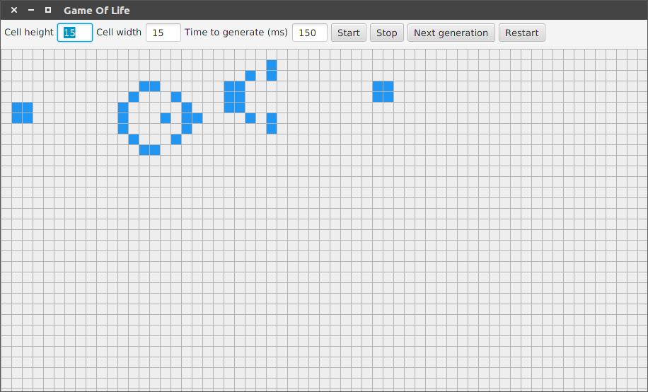

Game of Life UI
===============

This project contains a working copy of `Conway's Game of Life`_ implemented in JavaFX.

The game itself is implemented, so that a infinite space can be used. The user interface contains a sample region of the game. You are able to use the game to generate next generations by itself in an interative way or generate the next generation one by one. Properties used to display the game are:

- Width of a lifeform
- Height of a lifeform
- Time in millis that is waited until the next generation is calculated

Installation
============

To run the game clone this repository and package the java archive

.. code-block:: shell

    git clone https://github.com/captain-proton/gameoflife.git
    cd gameoflife
    mvn package

With the use of the shade plugin a jar is build under the target dir with the name ``game-of-life.jar``. You can run the jar simply by using:

.. code-block:: shell

    java -jar target/game-of-life.jar

Modification
============

Some samples are given inside the class ``GameOfLifeSample.java``. These sample can be used inside the ui or any other class that uses the game. Find the line:

.. code-block:: java

    private final GameOfLife gameOfLife = GameOfLifeSample.GosperGliderGun;

Use any sample that is present or just an empty game of life.

.. _Conway's Game of Life: https://en.wikipedia.org/wiki/Conway%27s_Game_of_Life
